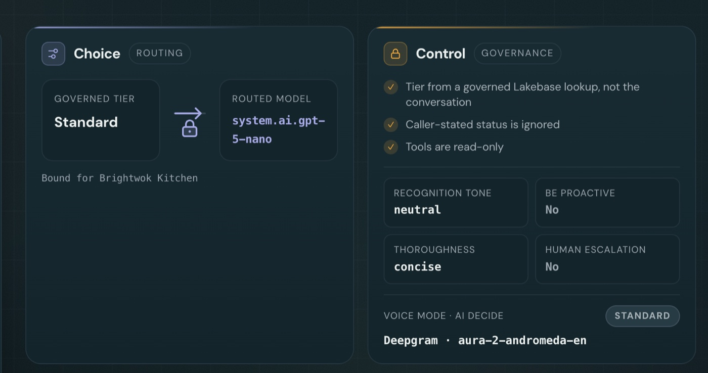
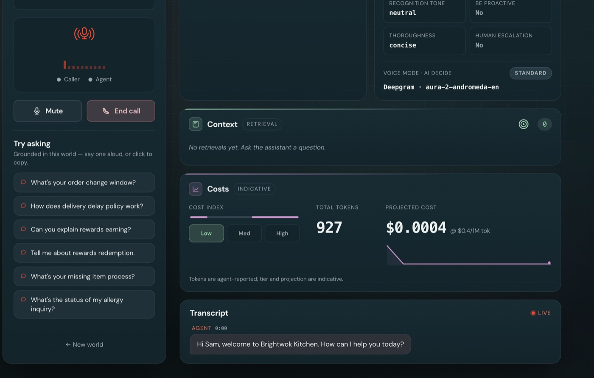
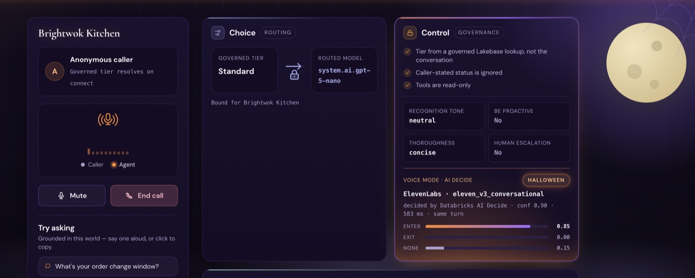
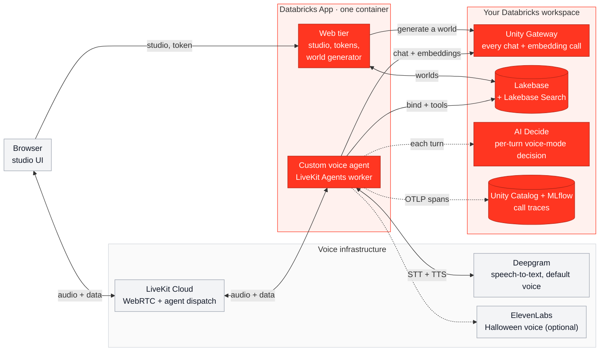

# DIVA: Databricks Intelligent Voice Agents

[](https://www.databricks.com/blog/agent-bricks-dais-2026)
[](https://www.databricks.com/product/databricks-apps)
[](https://www.databricks.com/product/lakebase)
[](https://www.databricks.com/blog/unity-ai-gateway-generally-available)
[](https://docs.databricks.com/aws/en/mlflow3/genai/tracing/trace-unity-catalog)
[](https://www.databricks.com/blog/introducing-aidecide-make-fast-decisions-your-governed-data)

[](https://docs.livekit.io/agents/)
[](https://www.python.org/downloads/)
[](https://docs.astral.sh/uv/)
[](LICENSE)

**A blueprint for real-time voice agents on Databricks.** You open a browser, click call, and talk to an AI support
agent. Apart from the audio pipe, every layer runs on Databricks: the agent is a custom agent hosted on Databricks
Apps, every chat and embedding call goes through Unity Gateway, its answers come from Lakebase, and with tracing on
every call lands in MLflow as a trace.

## Built on Databricks

| | On Databricks | What it does here |
|:-:|---|---|
| ✅ | **[Custom agent on Agent Bricks](https://www.databricks.com/blog/agent-bricks-dais-2026)** | The voice agent is your own code, a LiveKit Agents worker. Agent Bricks supports custom agents built with any framework and hosts them on Databricks Apps. |
| ✅ | **[Databricks Apps](https://www.databricks.com/product/databricks-apps)** | The web tier and the agent run as one app in one container, with one deploy. |
| ✅ | **[Lakebase](https://www.databricks.com/product/lakebase) + [Lakebase Search](https://www.databricks.com/blog/lakebase-search-state-art-full-text-and-vector-search-postgres)** | Postgres holds each generated world (a fictional company's documents, customers and records), and Lakebase Search ANN finds the passages the agent answers from. |
| ✅ | **[Unity Gateway](https://www.databricks.com/blog/unity-ai-gateway-generally-available)** | Serves every chat and embedding call, so it powers all the LLMs. The app routes each loyalty tier to a model, the gateway serves it, and token usage and an indicative cost show up live. |
| ✅ | **[MLflow traces](https://docs.databricks.com/aws/en/mlflow3/genai/tracing/trace-unity-catalog)** | When tracing is on, each call's spans go over OpenTelemetry into a Unity Catalog table and show up as an MLflow trace. |
| ✅ | **[AI Decide](https://www.databricks.com/blog/introducing-aidecide-make-fast-decisions-your-governed-data)** (`ai_decide`) | Makes a fast decision on every turn, beside the LLM, through the [`ai_decide` REST API](https://docs.databricks.com/api/ai-functions/v1/ai-decide), about whether to change the experience mid-call. Say "switch to the spooky voice" and the whole studio follows. |

The reference implementation is the **Unity Gateway Voice Studio**, a customer-support agent where each fictional
company gets its own generated dataset. On a call the studio shows Unity Gateway's four pillars live: **Choice** (which
model this caller got), **Control** (the governance guarantees and the voice mode), **Context** (what Lakebase
retrieved) and **Costs** (token usage and an indicative cost). LiveKit carries the audio, Deepgram does speech-to-text
and the default voice, and ElevenLabs is the optional Halloween voice. Fork it, point it at your workspace, and swap in
your own data, prompts and tools.

The repo also ships an [Agent Skill](https://agentskills.io), `building-voice-agents-on-databricks`, so your coding
agent already knows the patterns and the traps. See [Agent skill](#agent-skill).

## See it

A call in the standard voice. **Choice** routes the Standard tier to `system.ai.gpt-5-nano` through Unity Gateway, and
**Control** shows the governance checks and the voice mode:



The lower panels: **Context** (empty until the caller asks something), **Costs** (927 tokens, an indicative $0.0004) and
the live transcript:



Ask for a spooky voice and AI Decide decides on that turn. The panel shows the decision (confidence 0.90, 583 ms), the
probability of each option, and the ElevenLabs voice now speaking, and the whole studio changes theme:



## How it works



The red boxes run on Databricks, and dotted lines are optional. A call goes like this:

1. **Join.** The web tier mints a short-lived LiveKit token, the browser joins a room on LiveKit Cloud, and LiveKit
   dispatches the agent into it.
2. **Bind.** The agent reads the caller's tier from Lakebase (never from what they say) and picks the model for it. The
   model itself never sees the tier.
3. **Talk.** Deepgram turns speech into text, the routed model answers through Unity Gateway, and a voice speaks the
   reply.
4. **Ground.** `semantic_search` runs a Lakebase Search ANN query over the caller's dataset, after embedding the
   question through the gateway. `record_lookup` reads only the caller's own records.
5. **Decide.** On every turn AI Decide runs beside the model and may switch the voice mode. A deterministic policy
   applies the change, and the model, the tier and the governance rules stay as they were (one exception: a made-up
   spooky story needs no tool).
6. **Show and trace.** Evidence (routing decision, retrieval hits, token usage, voice mode) streams to the UI over the
   LiveKit data channel. With tracing on, spans flush over OTLP into Unity Catalog, where they read as MLflow traces.

Before any call the studio can generate a world: a fictional company with documents, customers and records. Unity
Gateway drafts them and embeds the documents, and everything is written to Lakebase in one transaction. The full
walkthrough is in
[`docs/architecture.md`](docs/architecture.md), and the running app serves an interactive version at
`/architecture.html`.

## Prerequisites

| You need | For |
|---|---|
| A Databricks workspace with **Unity Gateway** (chat models for the tiers and for generation, plus an embedding model) | Every chat and embedding call |
| A **Lakebase** database with [Lakebase Search](https://www.databricks.com/blog/lakebase-search-state-art-full-text-and-vector-search-postgres) turned on (`lakebase_vector` + `lakebase_text`) | The data and retrieval |
| A **LiveKit** project (LiveKit Cloud is fine) and a **Deepgram** API key | Audio transport, speech-to-text, the default voice |
| A Databricks personal access token for that workspace, the Databricks CLI, and [`uv`](https://docs.astral.sh/uv/) (Python 3.12+) | The agent and web tier authenticate with the token. The CLI and the setup scripts use a profile you pick, and nothing here picks one for you: pass `--profile <name>` to CLI commands and set `DATABRICKS_CONFIG_PROFILE` for the scripts. |
| *Optional:* a Unity Catalog catalog and schema for trace tables, plus an MLflow experiment and a SQL warehouse to browse them | Traces. Tracing turns on only when `DATABRICKS_TRACE_CATALOG`, `_SCHEMA` and `_TABLE_PREFIX` are all set. |
| *Optional:* `ai_decide` enabled on the workspace (a Previews feature, turned on by an admin), and an ElevenLabs key | Halloween mode |

## Quickstart (local)

```bash
uv sync
cp .env.example .env.local     # fill in LiveKit, Deepgram, Databricks (host + token), Lakebase and model settings

# One-time Lakebase setup. These two scripts read the shell environment, not .env.local
# (export UG_GEN_MODEL / UG_EMBED_MODEL too if you use models other than the defaults).
export DATABRICKS_CONFIG_PROFILE=<your-profile>      # or DATABRICKS_HOST + DATABRICKS_TOKEN
export LAKEBASE_ENDPOINT=projects/<project>/branches/<branch>/endpoints/<endpoint>
export LAKEBASE_DATABASE=databricks_postgres UG_SCHEMA=ug
uv run python infra/apply_schema.py                  # schema + ANN/BM25 indexes
uv run python generate.py "Northwind Outfitters"     # optional: generate a world from the CLI

# Run each of these in its own terminal: the agent and the web tier keep running until you stop them.
uv run python app/agent.py dev                       # terminal 1: agent worker; wait for "registered worker"
uv run python app/web_server.py                      # terminal 2: studio UI on http://localhost:8000 (PORT overrides)
uv run pytest -q --ignore=tests/test_integration_data_plane.py   # terminal 3: that one test is live and writes two worlds
```

The agent worker and the web tier read `.env.local` themselves; only the two setup scripts need the exports.

Open the studio, generate a world (or pick a ready one), enter the call, choose a caller and press **Connect & talk**.
The studio suggests what to ask. Try an order question (Context), a Standard caller against a VIP one (Choice), then
"switch to the spooky voice" (AI Decide).

## Deploy as a Databricks App

The full walkthrough is in the skill at
[`skills/building-voice-agents-on-databricks/references/deployment.md`](skills/building-voice-agents-on-databricks/references/deployment.md),
or you can hand it to a coding agent with the skill loaded. The short version:

1. Compile the worker dependencies for the Apps runtime (Python 3.11):
   `uv pip compile agent-requirements.in --python-version 3.11 -o agent-requirements.txt`.
2. Put the 6 secrets (LiveKit URL, key and secret; Deepgram key; Databricks token; ElevenLabs key) in a secret scope and
   attach each to the app as a resource. `app.yaml` reads them through `valueFrom`, which only resolves once the
   resource exists, so attach all six before the first deploy ([details](docs/halloween-voice.md#turn-it-on)). No
   ElevenLabs key? Delete the `ELEVEN_API_KEY` entry from `app.yaml` and attach the other five: Halloween mode then uses
   the Deepgram voice.
3. Give the app's service principal `READ` on the scope and `CAN_MANAGE` on the workspace source folder.
4. Start the app, `databricks sync` a staging folder with `--full`, then run `databricks apps deploy`.
5. Tail `databricks apps logs`. You should see the web tier listening, then `registered worker` 30–60 seconds later.

Stuck? [`docs/gotchas.md`](docs/gotchas.md) lists the traps we hit (LiveKit, the Databricks platform, deploys, tracing)
and the fix for each.

## Halloween mode

Say "switch to the spooky voice" and the whole studio changes with it. **[AI Decide](https://www.databricks.com/blog/introducing-aidecide-make-fast-decisions-your-governed-data)**
classifies each turn outside the LLM, the agent switches to an ElevenLabs monster voice that performs audio cues such as
`[whispers]` and `[laughs]`, and the UI cross-fades into an "All Hallows' Console" theme. The tier, the model and the
governance rules don't change (one exception: on request the monster tells a made-up story, which needs no tool). It's
optional: without ElevenLabs the call uses a darker Deepgram voice, and `UG_AI_DECIDE=0` turns it off. Setup, settings,
the cue palette and how to verify the voice are in [`docs/halloween-voice.md`](docs/halloween-voice.md).

## Make it yours

For local runs, copy `.env.example` to `.env.local`. The deployed app reads the same settings from `app.yaml`. Swap
these placeholders for your own values:

| Placeholder | Replace with |
|---|---|
| `https://your-workspace.cloud.databricks.com` | your workspace URL |
| `projects/your-project/branches/production/endpoints/primary` | your Lakebase endpoint (`LAKEBASE_ENDPOINT`; database `databricks_postgres`) |
| `your_catalog`, `your_schema` | the catalog and schema for trace tables (`DATABRICKS_TRACE_CATALOG`, `DATABRICKS_TRACE_SCHEMA`) |
| `/Users/you@example.com/ugvoice` | your MLflow experiment path (only for reading traces back; export doesn't use it) |
| `your-sql-warehouse-id` | the SQL warehouse that reads traces (same) |

You'll see `ReferenceApp` / `<reference-app>` in a few comments and docs. That's an earlier LiveKit-on-Databricks app
this blueprint grew out of; it isn't in this repo.

## Agent skill

The repo ships [`skills/building-voice-agents-on-databricks/`](skills/building-voice-agents-on-databricks/SKILL.md), an
[Agent Skills](https://agentskills.io) bundle with what it took to get voice agents running on Databricks: the deploy
recipe, the worker and its Lakebase tools, Unity Gateway wiring, MLflow tracing, and the traps that cost the most time.
Copy it into `~/.cursor/skills/` or `~/.claude/skills/`, or leave it in the repo and open the workspace
([install notes](skills/README.md)). Then try:

```text
Deploy this voice agent as a Databricks App using the skill.
Add a Lakebase record_lookup tool the way the skill does.
The call connects but no agent joins. Follow the skill.
```

## What's inside

| Path | What it is |
|---|---|
| `app/` | The LiveKit agent worker (`agent.py`), its tools and tracing, the web tier (`web_server.py`) and the studio UI (`web/public/`) |
| `src/` | Routing policy, the governance prompt, the synthetic-world generator, and the Lakebase / gateway / retrieval services |
| `infra/` | The Lakebase schema, ANN and BM25 indexes, and `apply_schema.py` |
| `start_app.py`, `app.yaml` | The single-container Databricks App launcher and spec |
| `skills/` | The agent skill |
| `tools/` | Manual voice checks: a live AI Decide check, the TTS→STT cue bake-off and the live LLM cue check (see [Halloween mode](docs/halloween-voice.md#verify-the-voice)) |
| `docs/` | Architecture, Halloween mode, [gotchas](docs/gotchas.md), verified platform contracts and design specs ([index](docs/README.md)) |
| `tests/` | Over 1,000 tests. Leave out `test_integration_data_plane.py` unless you mean to run it: it is live and writes two worlds to Lakebase |

## Further reading

The repo is [datasciencemonkey/diva](https://github.com/datasciencemonkey/diva). If you're sharing it with someone, start
with these; [`docs/README.md`](docs/README.md#more-reading) has the longer list.

- **Agent Bricks and Databricks Apps:** [Agent Bricks at Data + AI Summit 2026](https://www.databricks.com/blog/agent-bricks-dais-2026) ·
  Docs: [Databricks Apps](https://docs.databricks.com/aws/en/dev-tools/databricks-apps/)
- **Unity Gateway:** [Generally Available](https://www.databricks.com/blog/unity-ai-gateway-generally-available) ·
  Docs: [Unity Gateway](https://docs.databricks.com/aws/en/unity-gateway/)
- **Lakebase:** [Lakebase Search: full text and vector search for Postgres](https://www.databricks.com/blog/lakebase-search-state-art-full-text-and-vector-search-postgres)
  (`lakebase_vector` ANN + `lakebase_text` BM25; DIVA builds both and the voice tool uses ANN) ·
  Docs: [Lakebase Postgres](https://docs.databricks.com/aws/en/oltp/)
- **MLflow traces:** Docs: [Store OpenTelemetry traces in Unity Catalog](https://docs.databricks.com/aws/en/mlflow3/genai/tracing/trace-unity-catalog)
- **AI Decide:** [Introducing ai_decide: make fast decisions on your governed data](https://www.databricks.com/blog/introducing-aidecide-make-fast-decisions-your-governed-data) ·
  Docs: [REST API](https://docs.databricks.com/api/ai-functions/v1/ai-decide) · [`ai_decide` SQL function](https://docs.databricks.com/aws/en/sql/language-manual/functions/ai_decide)
- **The voice stack:** [LiveKit Agents](https://docs.livekit.io/agents/) · [Deepgram](https://developers.deepgram.com/docs/models-languages-overview)

## License

MIT. See [LICENSE](LICENSE).
